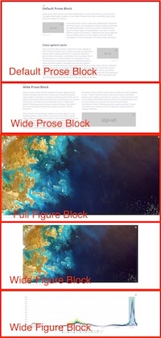
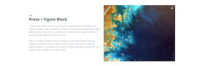
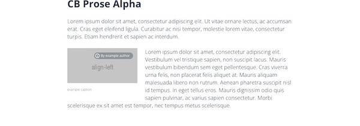

## How to write contents for Delta dashboard

### Background & Prerequisites

Delta dashboard content uses [MDX](https://mdxjs.com/docs/what-is-mdx/) for its content. To most simply put, MDX combines Javascript components and Markdown. By using MDX, Delta dashboard can offer editors rich experience with custom components while still having a way of writing text-based content with markdown syntax.

Understanding of MDX is not required to write contents for Delta dashboard, but you need to know how to write [Markdown](https://docs.github.com/en/get-started/writing-on-github/getting-started-with-writing-and-formatting-on-github/basic-writing-and-formatting-syntax), and to be familiar with the concept of [JSX](https://facebook.github.io/jsx/).

### Block

`Block` is a basic 'building block' for Delta dashboard contents. Any contents needs to be wrapped with `Block` component. The type of Block, and the combination of its children elements will decide the layout of the content block. When there is a layout change, you can assume that there is a change of block type. The image below shows what block was used for each layout.

<table>
<tr>
<td>

   
 </td>
 <td > 
 
    
  </td> 
</tr>
</table>


We currently (2022, March) have 8 types of Blocks for layout. Mind that only `Prose` and `Figure` can be direct children of Block. Any raw markdown contents can be wrapped with `Prose`. Any media contents or custom components (`Image`, `Map`, `Chart` ...) should be wrapped with `Figure`. 

<table style="margin-top: 20px">
<tr>
<th> Type </th><th width='300px'> Syntax </th> <th> Result </th>
</tr>
<tr>
  <td> Default Prose Block </td>
  <td> 

  ```code
  <Block>
    <Prose>
      ### Your markdown header

      Your markdown contents comes here.
    </Prose>
  </Block>
  ```  
  </td> 
  <td>  

     
  </td>
</tr>

<tr>
  <td> Wide Prose Block </td>
  <td> 

  ```code
  <Block type='wide'>
    <Prose>
      ### Your markdown header

      Your markdown contents comes here.
    </Prose>
  </Block>
  ```  
  </td> 
  <td>  

  
  </td>
</tr>

<tr>
  <td> Wide Figure Block </td>
  <td> 

  ```
  <Block type='wide'>
    <Figure>
      <Image ... />
      <Caption ...> caption </Caption>
    </Figure>
  </Block>
  ```

  </td> 
  <td>  

  
  </td>
</tr>

<tr>
  <td> Full Figure Block </td>
  <td> 

  ```code
  <Block type='full'>
    <Figure>
      <Image ... />
      <Caption ...> caption </Caption>
    </Figure>
  </Block>
  ```
  </td> 
  <td>  

  
  </td>
</tr>

<tr>
  <td> Prose Figure Block </td>
  <td> 

  ```
  <Block>
    <Prose>
      My markdown contents
    </Prose>
    <Figure>
      <Image ... />
      <Caption> ... </Caption>
    </Figure>
  </Block>
  ```
  </td> 
  <td>  
  
  
  </td>
</tr>


<tr>
  <td> Figure Prose Block </td>
  <td> 

  ```
  <Block>
    <Figure>
      <Image ... />
      <Caption> ... </Caption>
    </Figure>
    <Prose>
      My markdown contents
    </Prose>
  </Block>
  ```
  </td> 
  <td>  

  
  </td>
</tr>

<tr>
  <td> Prose Full Figure Block </td>
  <td> 

  ```
  <Block type='full'>
    <Prose>
      My markdown contents
    </Prose>
    <Figure>
      <Image ... />
      <Caption> ... </Caption>
    </Figure>
  </Block>
  ```
  </td> 
  <td>  

  
  </td>
</tr>

<tr>
  <td> Full Figure Prose Block </td>
  <td> 


  ```
  <Block type='full'>
    <Figure>
      <Image ... />
      <Caption> ... </Caption>
    </Figure>
    <Prose>
      My markdown contents
    </Prose>
  </Block>
  ```
  </td> 
  <td>  

  
  </td>
</tr>
</table>


### Image 

To offer rich visual and better experience, Delta dashboard offers `Image` component, which is a wrapper for `` HTML tag. You can use `Image` component to display any kind of image. Depending on where Image is used (is it inside of `Prose` as an inline image? or inside of `Figure`?), there are additional attributes you need to pass.

Also you can pass any attribute that you can use with `` HTML element and these will get passed down. Ex. you can pass width of image or height of image with `width`, `height`.

| Option | Type | Default | Description|
|---|---|---|---|
| src | string | '' | Path for image. If using local image, please look at the section below. |
| alt | string | '' | Description for image, this will be used for screen readers. |
| align | string, enum (left, right, center) | 'center' | <b>For inline image.</b> Alignment of image. |
| attr | string | '' | <b>For inline image.</b>  Caption text for inline image. |
| attrAuthor | string | '' | Info for image author. When omitted, attribution mark on the right-top part of the figure wouldn't show up. |
| attrUrl | string | '' | Link for image attribution. |

#### Inline image & Figure image

`Image` component can take different attributes depending on its context. When `Image` is used in `Prose`, it is inline image. When `Image` is used in `Figure`, it is Figure image. The table below shows the syntax for each type of image.

<table>
  <tr>
    <th>Type of image</th>
    <th>Syntax</th>
    <th>How it looks on the page</th>
    <th>Description</th> 
  </tr>

  <tr>
    <td>
      Inline
    </td>
    <td>

  ```
    <Image 
      src="http://via.placeholder.com/256x128?text=align-left" 
      alt="Media example" 
      align="left" 
      attr="example caption" 
      attrAuthor="example author"
      attrUrl="https://example.com"
      width="256"
    />
  ```
  </td>

  <td> 
 
  
  </td>
  
  <td>

      Use this type of `Image` when you  need to put an image inside of `Prose`.
  </td> 
  </tr>

<tr>
<td>

  Figure
 </td>
<td>

  ```
    <Figure type='full'>
      <Image
        src="http://via.placeholder.com/1200x800?text=figure" 
        alt='description for image'
      />
      <Caption 
        attrAuthor='Development Seed' 
        attrUrl='https://developmentseed.org'
      >
        This is an image. This is <a href="link">a link</a>.
      </Caption> 
    </Figure>
  ```
 </td>
 <td > 

  
  </td> 
  <td>

  You can replace `attr` option with `<Caption>` component if your image is used in `Figure` block. In this way, you can display rich text as Caption. 
  </td>
</tr>

</table>


#### How to use local image

...WIP...

### Chart

| Option | Type | Default | Description|
|---|---|---|---|
| dataPath | string | '' | Path for data. The data should be either in `csv` or `json` format. |
| xKey | string | '' | Attribute to be used for x axis. |
| yKey | string | '' | Attribute to be used for y axis |
| idKey | string | '' | Attribute for each data point |
| dateFormat | string | '' | Template for how temporal date is formatted. This follows [d3's convention for date format](https://github.com/d3/d3-time-format#locale_format) |
| highlightStart | string | '' | Start point for x axis to draw highlighted area. |
| highlightEnd | string | '' | End point of x axis to draw highlighted area.
| highlightLabel | string | '' | Label for highlighted area. |

Syntax for Chart used in Wide Figure Block looks like this

```
<Block type='wide'>
  <Figure>
    <Chart
      dataPath='example.csv'
      dateFormat="%m/%d/%Y" 
      idKey='County' 
      xKey='Test Date' 
      yKey='New Positives' 
      highlightStart = '12/10/2021'
      highlightEnd = '01/20/2022'
      highlightLabel = 'Omicron'
    />
    <Caption 
      attrAuthor='attribution for wide figure block, chart' 
      attrUrl='https://developmentseed.org'
    /> 
  </Figure>
</Block>

```


### Map

...WIP...

## Some gotchas

- Do not use h1(`# heading 1`) for your header. h1 is reserved for page title.