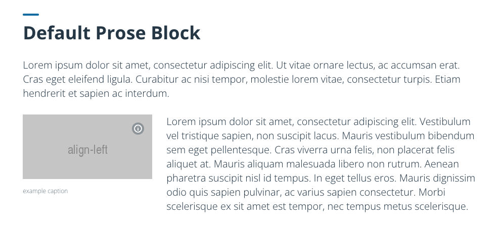
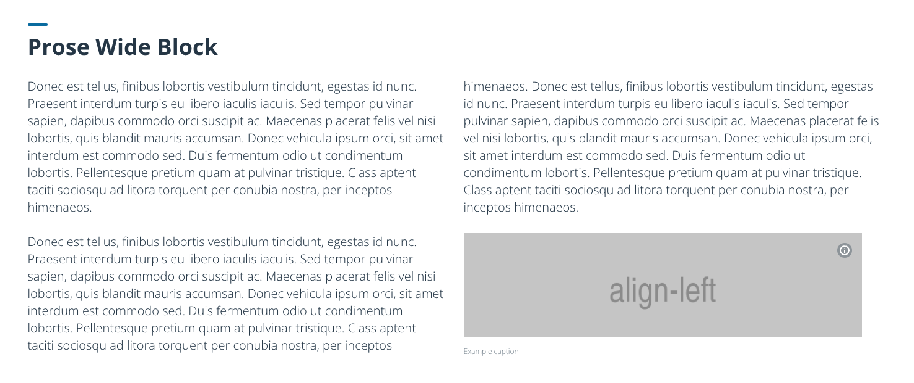

## How to write contents for Delta dashboard
### Prerequisites
This doc assumes that you already know how to write Markdown, and are familiar with the concept of component. 

### Block

`Block` is a basic building 'block' for mdx contents. Any contents on mdx docs needs to be wrapped with `Block` component. The type of Block, and the combination of its children element will decide the layout of the content block. There are the 8 kinds of Blocks that we offer. 

Only `Prose` and `Figure` can be direct children of Block. Any raw markdown contents can be wrapped with `Prose`, any media contents or custom components (Image, Map, Chart) should be wrapped with Figure. 

#### 1. Default Prose Block
: Text contents block, with default container. If you have no opinion about what layout should be used for your contents, go with this default one. 

This is the syntax for Default Prose block/

```
<Block>
  <Prose>
    ### Your markdown header

    Your markdown contents comes here.
  </Prose>
</Block>
```

The syntax will result in a block which looks like this.



#### 2. Wide Prose Block
: Text contents block, with wider container and two columns. 

You can pass `type='wide'` to `Block` like below to have Wide Prose Block.

```
<Block type='wide'>
  <Prose>
    ### Your markdown header

    Your markdown contents comes here.
  </Prose>
<Block type>
```

This is how Wide Prose Block looks like.



#### 3. Wide Figure Block
: Figure (Image, Chart, Map, other media) block with wider container. 

The example syntax below uses `Image` as its Figure content.
```
<Block type='wide'>
  <Figure>
    <Image ... />
    <Caption ...> caption </Caption>
  </Figure>
</Block>
```

#### 4. Figure Full Block
: Figure (Image, Chart, Map, other media) block with full bleeding container. 

The example syntax below uses `Map` as its Figure Content
```
<Block type='full'>
  <Figure>
    <Map ... />
  </Figure>
</Block>
```

#### 5. Figure + Prose Block
: A block that has two columns with wider container, one column for Figure and one column for Prose. 

The example syntax below puts Prose on left, Figure on right.
```
<Block>
  <Prose>
    My markdown contents
  </Prose>
  <Figure>
    <Image src='' />
    <Caption> caption </Caption>
  </Figure>
</Block>
```

The example syntax below puts Figure on left, Prose on right.
```
<Block>
  <Figure>
    <Image src='' />
    <Caption> caption </Caption>
  </Figure>
  <Prose>
    My markdown contents
  </Prose>
</Block>
```

6. Figure + Prose Full Block
: A block that has two uneven columns with one-side-full-bleeding container, one bleeding column for Figure and one restricted column for Prose. 


The example syntax below puts Prose on left, Figure on right bleeding to the end.
```
<Block type='full'>
  <Prose>
    My markdown contents
  </Prose>
  <Figure>
    <Image src='' />
    <Caption> caption </Caption>
  </Figure>
</Block>
```

The example syntax below puts  Figure on left bleeding to the end, Prose on left,
```
<Block type='full'>
  <Figure>
    <Image src='' />
    <Caption> caption </Caption>
  </Figure>
  <Prose>
    My markdown contents
  </Prose>
</Block>
```
### Image (inside of Prose)

You can use `Image` component to display any kind of image. If you need to put images inside of Prose block, there is an additional parameter, `align` that needs to be passed to decided alignment of image inside of paragraphs.

```
  <Image 
    src="http://via.placeholder.com/256x128?text=align-left" 
    alt="Media example" 
    align="left" 
    attr="example caption" 
    attrAuthor="penguin"
    attrUrl="https://linux.org"
    width="256" 
  />
```

There are two ways of putting caption for your image,

1. use attr props (recommended for inline image)

2. use Caption component (recommended for Figure )


#### Caption

```
  <Figure>
    <Image
      src='https://picsum.photos/id/1002/2048/1024'
      alt='Generic placeholder by lorem picsum'
    />
    <Caption 
      attrAuthor='somebody' 
      attrUrl='https://developmentseed.org'
    >
      This is an image.
    </Caption> 
  <Figure>
```

#### Map
### Chart


## Some gotachas

- Do not use H1 for your header. 