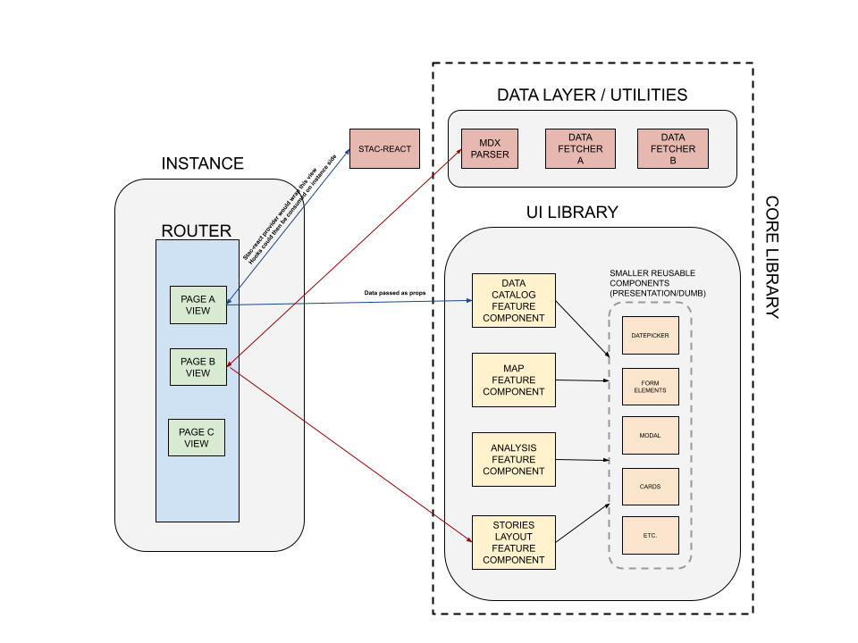

# Application Architecture for Configurability

* Status: **In Review**, In Progress, Done
* Authors: @j08lue, @sandrahoang686, @faustoperez
* Deciders: @j08lue, @faustoperez, @hanbyul-here
* As of: 2024/03

## Context and Problem Statement

VEDA UI 1.0 was built as a reusable white-label application for independent science data and information projects. These projects should be able to stand up and configure their own instance with their content. The assumption was that projects would reuse the entire application and change mostly the styling and scalable content items such as datasets and stories, and would only need to change a few other elements. The application (pages, functional components; VEDA UI) is separate from content (VEDA config) and pages and elements can be changed via component overrides.

In 2023, our team supported two new projects to integrate VEDA UI for their needs: the U.S. Greenhouse Gas Center (earth.gov/ghgcenter) and the Earth Information Center (EIC; earth.gov). These projects had much wider needs for customization or adaptation, mostly related to the context of the project:
1. Different thematic categorization of content with hierarchies or tags
2. Project-specific headers and disclaimers on several pages, also static / functional ones like the data catalog
3. Changes to navigation - main, secondary, page
4. Additional pages
5. New CMS-typical content types like events or announcements

We are expecting new instances to start using VEDA in 2024.

### Challenge 1: Cumbersome customization to the degree required
Implementing these additional customizations proved to be cumbersome with the current application structure, because they require page overrides and new customization options across the application, which grew fast in complexity.

### Challenge 2: Unconventional combination mechanism for instance configuration and UI components (via Git)
The separation of application and content is currently done via Git submodules: the VEDA UI library source tree is injected into a Configuration project and then they are built together. This works and is lightweight, but is not a very common pattern which is an obstacle for new contributors to the project and new instances. 

### Need for a decision: continue to modify, refactor, or rewrite?
The challenges mentioned above have perceivably slowed down our development of new features and made addressing integration project needs cumbersome in recent quarters. We expect the number of instances of VEDA UI to grow, which is great, but makes the need to make a decision whether to make fundamental changes to the application architecture more pressing.

We also need to take into account that the evolution of the application with new and improved features needs to continue and we have limited team resources.

## Decision Drivers

- Investment payoff
- Compatibility with continued support for instances with feature evolution
- Improve developer velocity
- Ease of support for required customizations

## Considered Options

- [1] Continue with current application architecture
- [2] Refactor component library + rewrite instances
- [3] Rewrite component library + rewrite instances

## Decision Outcome

✔️ [2] Refactor component library + rewrite instances

Move more control to the instance level, modularize the core ui library to expose core feature components and smaller reusable components, and create a data layer as part of the core ui library that is ideally also consumed at the instance level that manages data fetching and MDX parsing so that components are data agnostic.

#### 1. Move Routing from the core ui library to the instance level
Routing and what pages exist should be determined at the instance level. Currently, routing is handled at the core UI library level so supporting additional/removal of pages requires override logic. Moving this to the instance level allows developers/stakeholders to independently manage their routes and pages.

#### 2. Feature components in the core ui library composed at the instance level
Currently, the core UI library handles the composition of each page because of its control over routing. However, pages and what they render should shift to the instance level so developers/stakeholders can control what is rendered within each page view. The core UI library should expose feature components (containers) that deliver a core feature in the VEDA dashboard such as the A&E feature. 

#### 3. Modularize and create smaller reusable components
The core UI library should also expose smaller reusable components like date pickers, form elements, analysis tools, etc… (“presentational/dumb” components). This way developers/stakeholders for example can compose a page view with the A&E feature from the core UI library and consume other reusable components to construct their page view. This also now allows developers to build their own custom components on the instance side and directly incorporate them. 

#### 4. Create a Data layer that manages all data fetching
The proposed data layer is designed to handle all data fetching, including STAC calls, and MDX parsing. Think of it as a versatile data utilities library. Introducing this layer would enable components in the core UI library to remain data-agnostic. In the event of scaling to additional or different data sources, expansion can be easily accomplished by integrating them into this centralized layer. Smart components (larger and stateful) would then efficiently consume this data layer.
> **Integrating with [stac-react](https://github.com/developmentseed/stac-react/tree/main)**: Because these React hooks manage data fetching to the STAC API using the Context API provider pattern, this could just be used directly as it is already its own data layer. We would have to decide where we wrap the Provider though. Ideally, at the instance level, we would wrap the provider at the highest level in the tree either around the router or specific view containers and then consume these hooks down the hierarchy on the instance side. The components in the core ui library would be prop driven so this way they can be truly data agnostic and accept whatever data passed in.

**Architectural Diagram of the Refactor**

*[Miro Board Link](https://miro.com/app/board/uXjVN6lkBnc=/?share_link_id=85040810316) which documents team's brainstorming discussions, options considered, technical trade-offs, and final proposed solution in detail*

## Pros and Cons of the Options

### [1] Continue with current application architecture
- 💚 No up-front cost
- 🚩 Fulfilling the customization requirements means making the app more customizable through overrides, options, and flags/branches in code, increasing complexity, which has a cost in terms of developer velocity and onboarding

### [2] Refactor component library + rewrite instances
- 💚 A component library allows for more straightforward composition into applications with the customization (pages, layout, navigation, routing, data providers) that is required
- 💚 More efficient delivery of new instances with modified page views, without directly impacting the core UI logic library. Seamless support for a wider range of data integrations.
- 💚 As we refactor, we can see the new patterns emerge and hopefully implement feature improvements together with architecture improvements. However, rebuilding the instances with the components will basically mean a rewrite.
- 🚩 Refactoring is a complex process - risk of delay / failure.
- 🚩 The new architecture may demand deeper coding knowledge to set up a new instance. However this complexity is offset by the fact that making overrides in the current architecture is equally developer-intensive. We plan to establish a template instance that is easily cloneable for a quick start when spinning up new instances.

### [3] Rewrite component library + rewrite instances
- 💚 A component library allows for more straightforward composition into applications with the customization (pages, layout, navigation, routing, data providers) that is required
- 💚 More efficient delivery of new instances with modified page views, without directly impacting the core UI logic library. Seamless support for a wider range of data integrations. 
- 💚 Faster development without requiring specific domain knowledge on very custom dependencies.
- 🚩 Since we also need to continue supporting the current instances, we would need to invest into the rewrite while we also keep developing the current application. This offsets any returns on investment and increases the risk of failure.
- 🚩 The new architecture may demand deeper coding knowledge to set up a new instance. However this complexity is offset by the fact that making overrides in the current architecture is equally developer-intensive. We plan to establish a template instance that is easily cloneable for a quick start when spinning up new instances.

## Resources
* [Github Issue to gather strategic questions related to future of VEDA UI](https://github.com/NASA-IMPACT/veda-ui/issues/766)
*  [Refactoring vs Rewrite article](https://methodpoet.com/refactoring-vs-rewrite/)
* [Team Brainstorming session for VEDA V2 Refactor Miro Board](https://miro.com/app/board/uXjVN6lkBnc=/?share_link_id=238172590342)
* [Stac-react Repo](https://github.com/developmentseed/stac-react)
