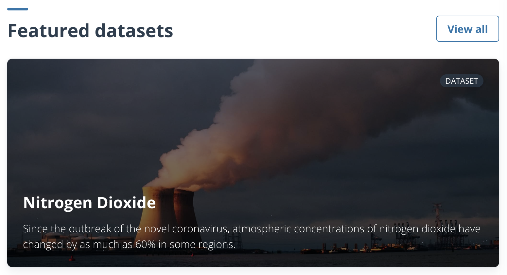
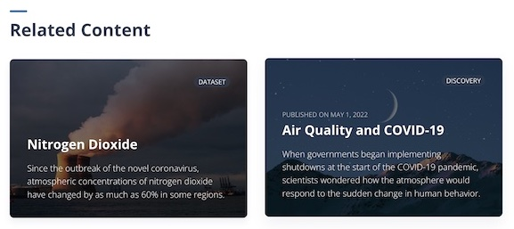

📇 **Shortcuts:**

- Check the [MDX_BLOCK.md](./MDX_BLOCKS.md) for information on the different blocks that can be used to compose the content layout.
- Check [layer.md](./frontmatter/layer.md) for details on the different properties of a dataset layer.
- Check [media.md](./frontmatter/media.md) for information on the images needed for the content's covers.
- Check [TAXONOMY.md](./TAXONOMY.md) for information on the available taxonomies for content.

----

# Content

- [Content](#content)
  - [Datasets](#datasets)
  - [Stories](#stories)

Veda consists of Datasets, and Stories.
Each piece of content is written in [MDX](https://mdxjs.com/docs/what-is-mdx/#what-is-mdx) with configuration frontmatter. Frontmatter is separate by a set of `---` from MDX content.  

A file will look something like:
```yml
---
id: story1
name: Example story
---

<Block>
  <Prose>
    ## About this story

    Once upon a time there was a content string
  </Prose>
</Block>
```

There are different types of `Block` components that can be used to create engaging content pieces.  
Each `Block` comes with its own rules and needed props, so check the [MDX_BLOCK.md](./MDX_BLOCKS.md) for the full details.

---

## Datasets

Frontmatter configuration for the Dataset
```yaml
---
id: string
name: string
description: string
media: Media

thematics: string[]
sources: string[]
featured: boolean

layers: Layer[]
related: Related[]
  - type: string
    id: string
    thematic: string
usage: Usage[]
  - url: string
    label: string
    title: string
---

<Block>
  <Prose>
    ## This is a Dataset

    Once upon a time there was a content string
  </Prose>
</Block>
```

MDX content for datasets will show up on its own page under `/data-catalog/:dataset-id`. For example, `no2` dataset MDX will show up under `/data-catalog/no2`.

**id**  
`string`  
Id of this dataset. Must be unique in the whole application

**name**  
`string`  
Name of this dataset. This is used to reference to this dataset in the application.

**description**  
`string`  
Brief description of this dataset. This is displayed on cards and the header of a dataset.

**media**  
`Media`  
Image to identify this resource. See [media.md](./frontmatter/media.md).

**taxonomy**  
`Taxonomy`  
List of taxonomies and their values. See [taxonomy.md](./TAXONOMY.md).
Example:
```yaml
taxonomy:
  - name: Topics
    values:
      - Covid 19
      - Agriculture
  - name: Source
    values:
      - Development Seed
```

**featured**  
`boolean`  
Whether this dataset is featured


**layers**  
`Layer[]`  
List of layers for this dataset. See [layer.md](./frontmatter/layer.md).  
Example:
```yaml
layers:
  - id: layerId
    ... # more props
  - id: anotherLayerId
    ... # more props
```

**related**  
`Related[]`  
List of related contents. This list will be displayed at the bottom of dataset overview like below.  
(The screenshot shows the case when there are 2 related content entries.)



Each content should be formatted like below. 

```yaml
  - type: dataset
    id: dataset-id
  - type: story
    id: story-id
```

**usage**  
`Usage[]`  
Links to examples for how to use this dataset.  
The usage information will be accessible from the header of a dataset page (via the _Analyze data (Python)_ button), from the explore page, and from any long form content through the use of the [NotebookConnectCallout](./MDX_BLOCKS.md#notebook-connect-callout).


**usage[].url**  
`string`  
URL for example on how to use this dataset.

**usage[].label**  
`string`  
A label for the type of interface this link opens. Currently, typical interfaces include a static notebook or a notebook hub.

**usage[].title**  
`string`  
Title of the page linked to for an example of how to use this dataset.  

Example:
```yaml
usage:
  - url: 'https://github.com/NASA-IMPACT'
    label: View example notebook
    title: 'Static view in VEDA documentation'
  - url: "https://nasa-veda.2i2c.cloud/"
    label: Run example notebook
    title: 'Interactive session in VEDA 2i2c JupyterHub (requires account)'
```

---

## Stories

Frontmatter configuration for the Story
```yaml
---
id: string
name: string
description: string
media: Media
pubDate: string

thematics: string[]
sources: string[]
featured: boolean

related: Related[]
  - type: string
    id: string
    thematic: string
---

<Block>
  <Prose>
    ## This is a story

    Once upon a time there was a content string
  </Prose>
</Block>
```

MDX content for stories will show up on its own page under `/stories/:story-id`. For example, `air-quality-and-covid-19` story MDX will show up under `/stories/air-quality-and-covid-19`.

**id**  
`string`  
Id of this story. Must be unique in the whole application.

**name**  
`string`  
Name of this story. This is used to reference to this story in the application.

**description**  
`string`  
Brief description of this story. This is displayed on cards and the header of a story.

**media**  
`Media`  
Image to identify this resource. See [media.md](./frontmatter/media.md).

**pubDate**  
`string`  
Publication date for this story. Should be in YYYY-MM-DD format.

**taxonomy**  
`Taxonomy`  
List of taxonomies and their values. See [taxonomy.md](./TAXONOMY.md).
Example:
```yaml
taxonomy:
  - name: Topics
    values:
      - Covid 19
      - Agriculture
  - name: Source
    values:
      - Development Seed
```

**featured**  
`boolean`  
Whether this story is featured


**related**  
`Related[]`  
List of related contents. This list will be displayed at the bottom of story page like below.  
(The example shows the case when there are 3 related content entries.)


Each content should be formatted like below

```yaml
  - type: dataset
    id: dataset-id
  - type: story
    id: story-id
```
