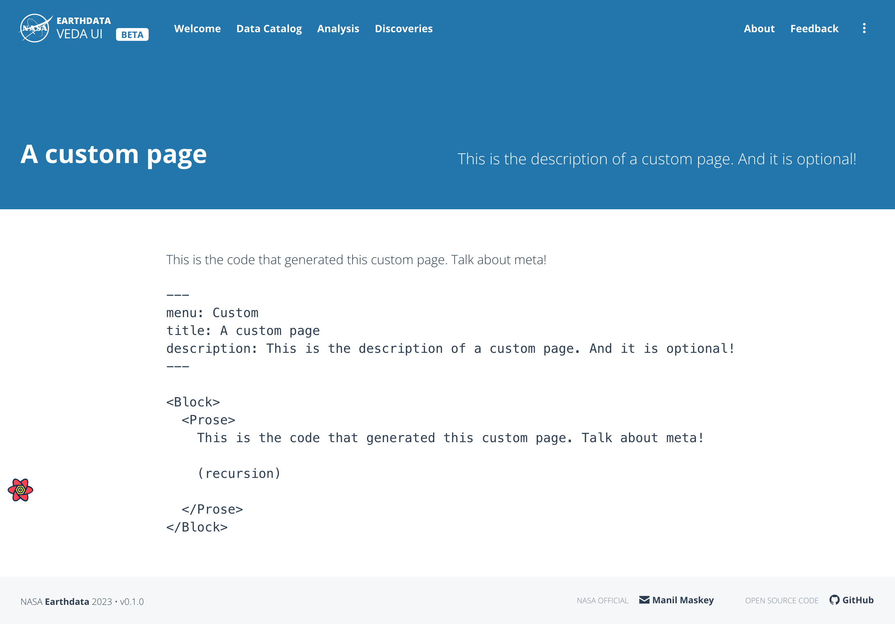

# Custom pages

To adapt the Veda dashboard to the individual needs of you instance you can create additional content pages.

These pages are defined under the `pageOverrides` property of `veda.config.js`. The `key` should be the desired url of the page (staring with a forward slash `/`), and the value should be a path to the MDX file to load.

```js
  pageOverrides: {
    '/custom-page': './pages/custom.mdx'
  }
```

The example above will make a page available at `/custom-page` with the content from the `custom.mdx` file.



## Frontmatter and content

Each custom page has the following properties:

**menu**  
`string`  
The menu label for this page.

**title**  
`string`  
Title for this page shown on the header.

**description**  
`string`  
Brief optional description of this page, shown on the header.

The content of the custom pages can be written using the different blocks available. Check the [MDX Blocks documentation](./MDX_BLOCKS.md) to see all the possibilities.  
If you are looking for something more custom, check the [creating complex overrides](./PAGE_OVERRIDES.md#creating-complex-overrides) section of PAGE_OVERRIDES.

