# Writing contents for Veda dashboard

- [Writing contents for Veda dashboard](#writing-contents-for-veda-dashboard)
  - [Background \& Prerequisites](#background--prerequisites)
  - [Block](#block)
  - [Link](#link)
  - [Notebook Connect Callout](#notebook-connect-callout)
  - [Image](#image)
    - [Inline image \& Figure image](#inline-image--figure-image)
      - [How to use local image (assets)](#how-to-use-local-image-assets)
  - [Chart](#chart)
  - [Map](#map)
  - [Scrollytelling](#scrollytelling)
    - [Chapter properties](#chapter-properties)
  - [Some gotchas](#some-gotchas)

## Background & Prerequisites

Veda dashboard content uses [MDX](https://mdxjs.com/docs/what-is-mdx/) for its content. To most simply put, MDX combines Javascript components and Markdown. By using MDX, Veda dashboard can offer editors rich experience with custom components while still having a way of writing text-based content with markdown syntax.

Understanding of MDX is not required to write contents for Veda dashboard, but you need to know how to write [Markdown](https://docs.github.com/en/get-started/writing-on-github/getting-started-with-writing-and-formatting-on-github/basic-writing-and-formatting-syntax), and to be familiar with the concept of [JSX](https://facebook.github.io/jsx/).

## Block

`Block` is a basic 'building block' for Veda dashboard contents. Any contents needs to be wrapped with `Block` component. The type of Block, and the combination of its children elements will decide the layout of the content block. When there is a layout change, you can assume that there is a change of block type. The image below shows what block was used for each layout.

<table>
<tr>
<td>

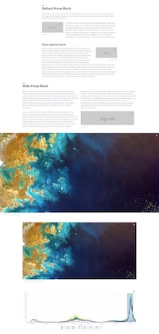   
 </td>
 <td > 
 
 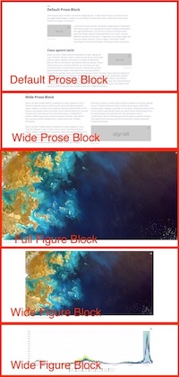   
  </td> 
</tr>
</table>


We currently (2022, May) have 8 different `Block` combinations to construct a layout and a standalone `ScrollytellingBlock`. Mind that only `Prose` and `Figure` can be direct children of Block. Any raw markdown contents can be wrapped with `Prose`. Any media contents or custom components (`Image`, `Map`, `Chart` ...) should be wrapped with `Figure`.

> If you are using a `Block` with more than one child element, mind that the order of children decides which one goes where. For example, in `FigureProse` Block, `<Figure>` comes before `<Prose>` in the syntax. In result, `Figure` shows up on the left, and `Prose` shows up on the right.

Layouts do work in any size of screen, but this documentation mainly addresses how they are represented on large (> 991px) screens.

<table style="margin-top: 20px">
<tr>
<th> Type </th><th width='300px'> Syntax </th> <th> Result </th>
</tr>
<tr>
  <td> Default Prose Block </td>
  <td> 

  ```jsx
  <Block>
    <Prose>
      ### Your markdown header

      Your markdown contents comes here.
    </Prose>
  </Block>
  ```  
  </td> 
  <td>  

  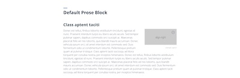   
  </td>
</tr>

<tr>
  <td> Wide Prose Block </td>
  <td> 

  ```jsx
  <Block type='wide'>
    <Prose>
      ### Your markdown header

      Your markdown contents comes here.
    </Prose>
  </Block>
  ```  
  </td> 
  <td>  

  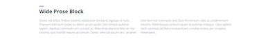
  </td>
</tr>

<tr>
  <td> Wide Figure Block </td>
  <td> 

  ```jsx
  <Block type='wide'>
    <Figure>
      <Image ... />
      <Caption ...> caption </Caption>
    </Figure>
  </Block>
  ```

  </td> 
  <td>  

  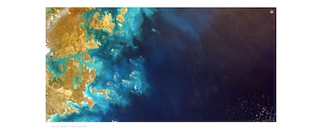
  </td>
</tr>

<tr>
  <td> Full Figure Block </td>
  <td> 

  ```jsx
  <Block type='full'>
    <Figure>
      <Image ... />
      <Caption ...> caption </Caption>
    </Figure>
  </Block>
  ```
  </td> 
  <td>  

  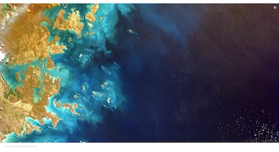
  </td>
</tr>

<tr>
  <td> Prose Figure Block </td>
  <td> 

  ```jsx
  <Block>
    <Prose>
      My markdown contents
    </Prose>
    <Figure>
      <Image ... />
      <Caption> ... </Caption>
    </Figure>
  </Block>
  ```
  </td> 
  <td>  
  
  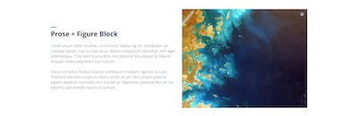
  </td>
</tr>


<tr>
  <td> Figure Prose Block </td>
  <td> 

  ```jsx
  <Block>
    <Figure>
      <Image ... />
      <Caption> ... </Caption>
    </Figure>
    <Prose>
      My markdown contents
    </Prose>
  </Block>
  ```
  </td> 
  <td>  

  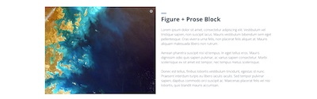
  </td>
</tr>

<tr>
  <td> Prose Full Figure Block </td>
  <td> 

  ```jsx
  <Block type='full'>
    <Prose>
      My markdown contents
    </Prose>
    <Figure>
      <Image ... />
      <Caption> ... </Caption>
    </Figure>
  </Block>
  ```
  </td> 
  <td>  

  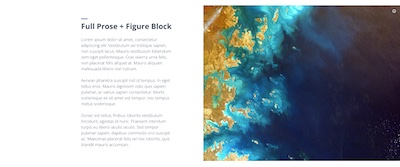
  </td>
</tr>

<tr>
  <td> Full Figure Prose Block </td>
  <td> 


  ```jsx
  <Block type='full'>
    <Figure>
      <Image ... />
      <Caption> ... </Caption>
    </Figure>
    <Prose>
      My markdown contents
    </Prose>
  </Block>
  ```
  </td> 
  <td>  

  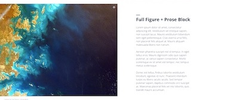
  </td>
</tr>
</table>

## Link

To create a bridge between the different types of content in the VEDA dashboard it may be necessary to create a link from one to another. One example of this would be linking to a dataset page from a discovery.

Since the dashboard may be made available under different domains at different times (for example staging environment and then production) it is a good idea to use relative links.  
This is not possible with normal markdown links, but you can use the `Link` component for this purpose.

Example:
```diff
- [My dataset](/data-catalog/my-dataset)
+ <Link to='/data-catalog/my-dataset'>My dataset</Link>
```
This will ensure that links work regardless of the environment the dashboard is in.

You can also use the `Link` component for external links, but it is not required. The following approached produce the same result.

```mdx
[DevSeed](http://developmentseed.org)
<Link to='http://developmentseed.org'>DevSeed</Link>
```

## Notebook Connect Callout

⚠️ This feature is still under development and may change at any time. ⚠️

When necessary, it is possible to include a callout to link to a dataset usage. This callout allows the user to add some custom text and define which dataset the callout is for. **Note that the linked dataset must have a [usage configuration](./CONTENT.md#datasets) defined on its file**.  

When the user clicks the button a modal will appear with the usage information.

| Option | Type | Description|
|---|---|---|
| datasetId | string | Id of the dataset to link to, as defined by the `id` property on the dataset MDX file. |

<table>
  <tr>
    <th>Syntax</th>
    <th>How it looks on the page</th>
  </tr>

  <tr>
  <td>

  ```jsx
    <NotebookConnectCallout datasetId='no2'>
      The No2 dataset is a great example of
      what this data can be used for, and
      you can also explore it on your own.
    </NotebookConnectCallout>
  ```
  </td>
  <td> 
 
  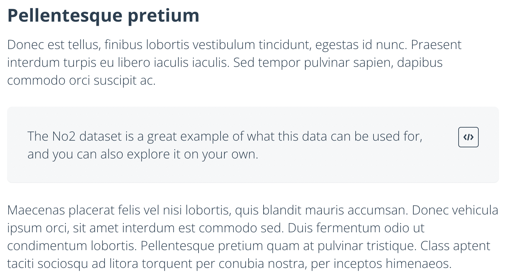

  The information on the modal is derived from the [usage configuration](./CONTENT.md#datasets) and it is not customizable.  

  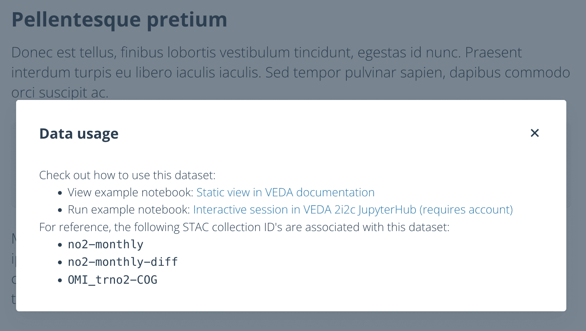
  </td>
  </tr>
</table>

The `NotebookConnectCallout` is meant to be used in a `<Prose>` component like any other text element. For example:
```jsx
<Block>
  <Prose>
    #### Pellentesque pretium

    Donec est tellus, finibus lobortis vestibulum tincidunt, egestas id nunc.

    <NotebookConnectCallout datasetId='no2'>
      The No2 dataset is a great example of what this data can be used for, and you can also explore it on your own.
    </NotebookConnectCallout>

    Maecenas placerat felis vel nisi lobortis, quis blandit mauris accumsan. Donec
    vehicula ipsum orci, sit amet interdum est commodo sed.

  </Prose>
</Block>
```

## Image 

To offer rich visual and better experience, Veda dashboard offers `Image` component, which is a wrapper for `` HTML tag. You can use `Image` component to display any kind of image. Depending on where Image is used (is it inside of `Prose` as an inline image? or inside of `Figure`?), there are additional attributes you need to pass.

Also you can pass any attribute that you can use with `` HTML element and these will get passed down. Ex. you can pass width of image or height of image with `width`, `height`.

| Option | Type | Default | Description|
|---|---|---|---|
| src | string | `''` | Path for image. If using local image, please look at the section below. |
| alt | string | `''` | Description for image, this will be used for screen readers. |
| align | string, enum (left, right, center) | `center` | <b>For inline image.</b> Alignment of image. |
| caption | string | `''` | <b>For inline image.</b>  Caption text for inline image. |
| attrAuthor | string | `''` | Info for image author. When omitted, attribution mark on the right-top part of the figure wouldn't show up. |
| attrUrl | string | `''` | Link for image attribution. |

### Inline image & Figure image

`Image` component can take different attributes depending on its context.  

When `Image` is used in `Prose`, it is inline image ad should be used when you need to put an image inside of `Prose`.

<table>
  <tr>
    <th>Syntax</th>
    <th>How it looks on the page</th>
  </tr>

  <tr>
  <td>

  ```jsx
    <Image 
      src="http://via.placeholder.com/256x128?text=align-left" 
      alt="Media example" 
      align="left" 
      caption="example caption" 
      attrAuthor="example author"
      attrUrl="https://example.com"
      width="256"
    />
  ```
  </td>
  <td> 
 
  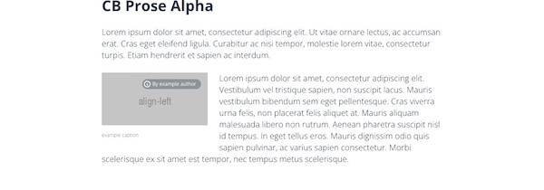
  </td>
  </tr>
</table>


When `Image` is used in `Figure`, it is Figure image.  
You can replace `attr` option with `<Caption>` component if your image is used in `Figure` block. In this way, you can display rich text as Caption. 

<table>
  <tr>
    <th>Syntax</th>
    <th>How it looks on the page</th>
  </tr>

  <tr>
  <td>

  ```jsx
  <Block type="full>
    <Figure>
      <Image
        src="http://via.placeholder.com/1200x800?text=figure" 
        alt='description for image'
      />
      <Caption 
        attrAuthor='Development Seed' 
        attrUrl='https://developmentseed.org'
      >
        This is an image. This is <a href="link">a link</a>.
      </Caption> 
    </Figure>
  </Block>
  ```
  </td>
  <td> 
 
  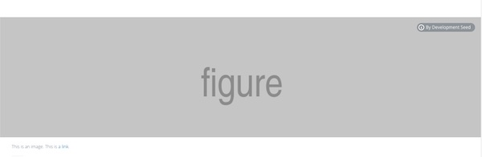
  </td>
  </tr>
</table>


#### How to use local image (assets)

Because of internal build process, you need to wrap the path with specific template when using local assets like below.

```js
new URL('where-your-image-is.jpg', import.meta.url).href
```

For example, if you put an image `image.jpg` inside of the folder where your mdx file is, the syntax for `Image` component will be like below.

```jsx
<Image
  src={new URL('./img.jpg', import.meta.url).href}
  align="left" 
  attr="tux" 
  attrAuthor="penguin"
  attrUrl="https://linux.org"
  width="256" 
/>
```

## Chart

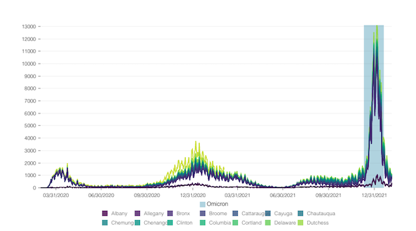

| Option | Type | Default | Description|
|---|---|---|---|
| dataPath | string | `''` | Path for data. The data should be either in `csv` or `json` format. Use parcel's URL builder to use local file. (Refer to the example below.) |
| xKey | string | `''` | Attribute to be used for x axis. |
| yKey | string | `''` | Attribute to be used for y axis. |
| idKey | string | `''` | Attribute for each data point. (The data will be sorted alphabetical order.) |
| dateFormat | string | `''` | Template for how temporal date is formatted. This follows [d3's convention for date format](https://github.com/d3/d3-time-format#locale_format) |
| xAxisLabel | string | `''` | Label for x axis. |
| yAxisLabel | string | `''` | Label for y axis. Use this attribute if the value needs unit such as `%`. |
| altTitle | string | `''` | Title of the chart. This will help increase the accessibility of Chart. |
| altDesc | string | `''` | Description of the chart. Avoid a generic description such as 'covid case chart'. Put what you are trying to deliver through the chart ex. 'covid case spiked throughout all the counties in New York state.') |
| colors | array | `undefined` | Colors for lines. Use [HTML color name](https://www.w3schools.com/colors/colors_names.asp). The order of colors needs to match to the order of lines. (Mind that the data is sorted alphabetically. So if you want to give `red` color for `apple` and `yellow` for `lemon`, you will need to pass [`red`,`yellow`] for `colors`. ) |
| colorScheme | string | `'viridis'` | One of [d3 chromatic diverging](https://github.com/d3/d3-scale-chromatic#diverging) or [sequential color scheme](https://github.com/d3/d3-scale-chromatic#sequential-multi-hue). Use only the name of the scheme. ex. if you want `schemePuOr`, use `puOr`. When `colors` is defined, `colorScheme` attribute is ignored.|
| highlightStart | string | `''` | Start point for x axis to draw highlighted area. |
| highlightEnd | string | `''` | End point of x axis to draw highlighted area.
| highlightLabel | string | `''` | Label for highlighted area. This label will sit on top of the legend.|

Syntax for Chart used in Wide Figure Block looks like this. Check how the data is formatted in [example.csv](./media/example.csv).

```jsx
<Block type='wide'>
  <Figure>
    <Chart
      dataPath={new URL('./example.csv', import.meta.url).href}
      dateFormat="%m/%d/%Y" 
      idKey='County' 
      xKey='Test Date' 
      yKey='New Positives' 
      highlightStart = '12/10/2021'
      highlightEnd = '01/20/2022'
      highlightLabel = 'Omicron'
    />
    <Caption 
      attrAuthor='attribution for wide figure block, chart' 
      attrUrl='https://developmentseed.org'
    /> 
  </Figure>
</Block>
```

## Map

| Option | Type | Default | Description|
|---|---|---|---|
| datasetId | string | `''` | `id` defined in dataset mdx. |
| layerId | string | `''` | `id` for layer to display. The layer should be a part of the dataset above. |
| dateTime | string | `''` | Optional. This string should follow `yyyy-mm-dd` format. When omitted, the very first available dateTime for the dataset will be displayed |
| compareDateTime | string | `''` | Optional. This string should follow `yyyy-mm-dd` format. A date should only be specified if you wish to display the comparison slider |
| compareLabel | string | `''` | Text to display over the map when the comparison is active. If is for example used to indicate what dates are being compared. If not provided it will default to the value specified in the [dataset layer configuration](./frontmatter/layer.md#compare) |
| projectionId | string | `mercator` | The id of the [projection](./frontmatter/layer.md#projections) to load. |
| projectionCenter | [int, int] | `''` | Projection center for Conic projections |
| projectionParallels | [int, int] | `''` | Projection parallels for Conic projections |
| allowProjectionChange | boolean | `true` | Whether or not the user can change the position using a projection selector dropdown added to the map |

Syntax for Map, which displays `nightlights-hd-monthly` layer from `sandbox` dataset in full figure block looks like this:

```jsx
<Block type='full'>
  <Figure>
    <Map
      datasetId='sandbox'
      layerId='nightlights-hd-monthly'
      dateTime='2020-03-01'
    />
    <Caption>
      The caption displays below the map.
    </Caption>
  </Figure>
</Block>
```

## Scrollytelling

> "Scrollytelling" was a term first coined to describe online longform stories characterised by audio, video and animation effects triggered by simply scrolling the page. - [An introduction to scrollytelling](https://shorthand.com/the-craft/an-introduction-to-scrollytelling/index.html).

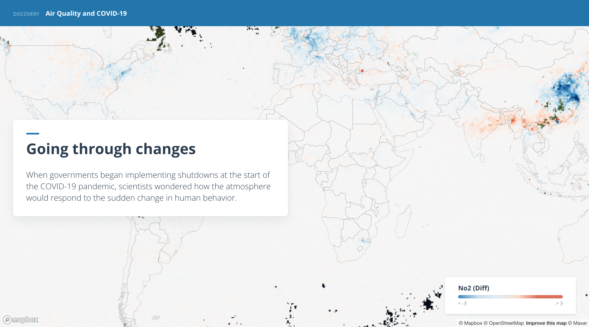

The Scrollytelling feature of Veda is map based and allows you to define different `Chapters` where each chapter corresponds to a map position and layer being displayed.  
As the user scrolls the chapter content comes into view on top of the map which will animate to a specific position.

The scrollytelling is defined as a series os `Chapters` inside the `ScrollytellingBlock`.

```jsx
<ScrollytellingBlock>
  <Chapter
    center={[0, 0]}
    zoom={2}
    datasetId='no2'
    layerId='no2-monthly-diff'
    datetime='2021-03-01'
  >
    ## Content of chapter 1

    Markdown is supported
  </Chapter>
  <Chapter
    center={[-30, 30]}
    zoom={4}
    datasetId='no2'
    layerId='no2-monthly-diff'
    datetime='2020-03-01'
  >

  Each chapter is a box where content appears.
  </Chapter>
</ScrollytellingBlock>
```

### Chapter properties
| Option | Type | Description |
|---|---|---|
| center | [number, number] | Center coordinates for the map [Longitude, Latitude] |
| zoom | number | Zoom value for the map |
| datasetId | string | `id` of the Dataset to which the layer to to display belongs |
| layerId | boolean | `id` of the dataset layer to display |
| datetime | boolean | Optional. If the layer to display has a temporal extent, specify the datetime |
| showBaseMap | boolean | Optional. If there is a need to show basemap without any additional layers ontop, pass `true`. (datasetId, layerId can be omitted when `showBaseMap` is `true`) |
| projectionName | string | `mercator` | The name of the [projection](./frontmatter/layer.md#projections) to load. |
| projectionCenter | [int, int] | Projection center for Conic projections |
| projectionParallels | [int, int] | Projection parallels for Conic projections |


🧑‍🎓 **Notes on projections**  
- As with other properties, the user is not allowed to change the projection used in a chapter
- Once a chapter with a set projection is reached, that projection will be used on subsequent chapters, until one specifies a different projection.

## Some gotchas

- Do not use h1(`# heading 1`) for your header. `h1` is reserved for page title.
