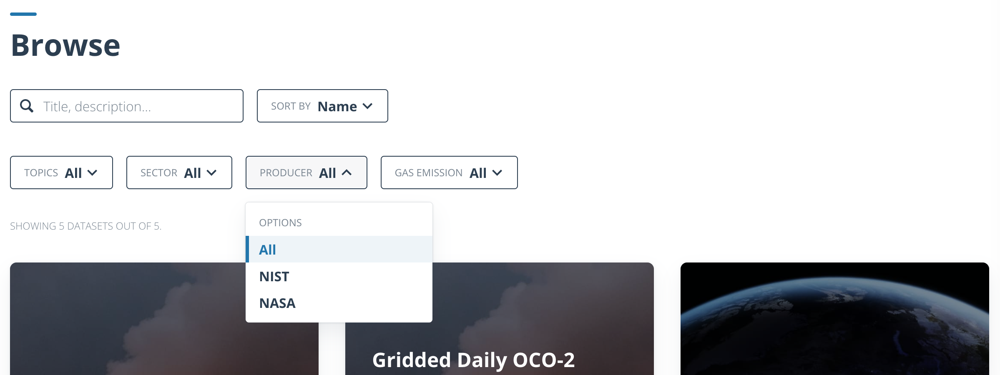
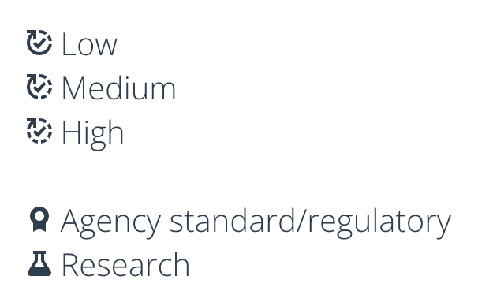

# Content

- [Content](#content)
  - [Adding taxonomies to content](#adding-taxonomies-to-content)
  - [Specific taxonomies](#specific-taxonomies)

VEDA content types, like stories and datasets, have taxonomies that can be used to group and filter content.

##  Adding taxonomies to content

A content type can have an arbitrary number of taxonomies which are defined under the `taxonomies` key in the content's frontmatter.  
Each taxonomy is defined by a name, and a list of values. It is important that the taxonomy name and its values are written in a human readable way, and that they are consistently used across all content. It is also recommended that taxonomy names are singular.

For example, the following frontmatter defines two taxonomies, `Topics` and `Source`, with the values `Covid 19`, `Agriculture`, and `Development Seed`:

```yaml
name: Dataset Name
  - name: Topics
    values:
      - Covid 19
      - Agriculture
  - name: Source
    values:
      - Development Seed
```

Note how the values are used: starting with a capital letter, and using spaces instead of dashes or underscores. This is because the values are displayed to the user, and should be as readable as possible.



## Specific taxonomies

Some taxonomies are specific/reserved for a content type.  
- Both stories and datasets must have a `Topics` taxonomy which will be displayed in a pill on the content card.
- For stories, if the `Source` taxonomy is used, it will be displayed in on the content card.
- Datasets should have a "Grade" and "Uncertainty" taxonomies which are displayed as icons.
  
**Grade and Uncertainty**  
These are two special taxonomies related to datasets and are displayed as icons on the dataset card.  
Although they are added to a dataset like any other, can only have ONE value each and are restricted to the values below.

- `Uncertainty`: Degree of uncertainty of this dataset.
  - High
  - Medium
  - Low
- `Grade`: Indicates the use that a dataset is recommended or suitable for.
  - Research
  - Agency standard/regulatory

