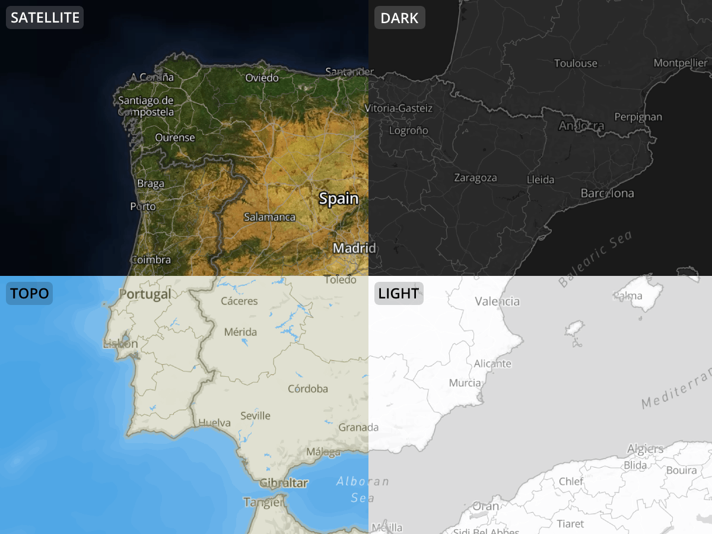
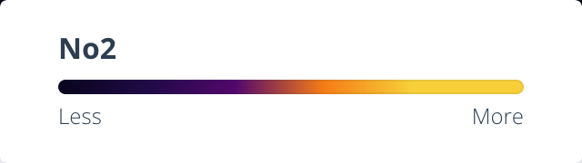
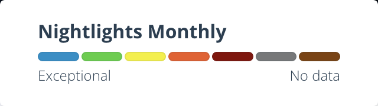

# layer

- [layer](#layer)
  - [Properties](#properties)
    - [Projection](#projection)
    - [Legend](#legend)
    - [Analysis](#analysis)
    - [Compare](#compare)
  - [Function values](#function-values)

```yaml
id: string
stacCol: string
stacApiEndpoint: string
tileApiEndpoint: string
name: string
type: string
initialDatetime: 'oldest' | 'newest' | Date(YYYY-MM-DD) = 'newest'
description: string
projection: Projection
basemapId: 'dark' | 'light' | 'satellite' | 'topo'
zoomExtent: [int, int] | null | fn(bag)
bounds: [int, int, int, int] | null | fn(bag)
sourceParams:
  [key]: value | fn(bag)
compare: Compare
legend: Legend
analysis: Analysis
media: Media
info: Info
```

## Properties

> 🙋 Several layer properties support functions to provide the app with dynamic values. See [Function values](#function-values) at the end of the document for details.

**id**  
`string`  
Id of the layer, using lowercase characters and dashes (Example: `no2-monthly-diff`).  
Must be unique in a dataset.  

**stacCol**  
`string`  
The stac collection that this layer should load.

**stacApiEndpoint**  
`string`  
The stac api endpoint that has the collection. If not defined, environment variable `API_STAC_ENDPOINT` is used.

**tileApiEndpoint**  
`string`  
The tile endpoint to use. If not defined, environment variable `API_RASTER_ENDPOINT` is used.

**name**  
`string`  
Name of the layer for display purposes.

**type**  
`raster | vector`  
The type of the layer will define how the data is displayed on the map.  
⚠️ Vector datasets are should be in vector titles format with a source layer named `default`. It is currently not possible to customize the style of the dataset's features.

**description**  
`string`  
Brief description of the layer. Will be shown in an info box.

**initialDatetime**  
`'oldest' | 'newest' | Date(YYYY-MM-DD) = 'newest'`  
Define the initial date that is shown when enabling a timeseries layer. This value is used if no valid date is provided via the url parameters

**zoomExtent**  
`[int, int] | fn(bag)`  
Minimum and maximum zoom values for the layer. Below the minimum zoom level the layer will not be shown, but markers will be displayed to indicate where data is available. 
For raster and zarr layer, only minimum zoom will be respected and the maximum zoom will be automatically fetched from STAC endpoint.

**sourceParams**  
`object`  
Parameters to be appended to the tile source. The values will be used as provided as query string parameters.  
These values may vary greatly depending on the layer being added but some may be:
- **rescale**  
  `[int, int] | fn(bag)`  
  Minimum and maximum value for the rescale. This value is used for the color mapping, such that the minimum value corresponds to the starting color of the color map, and the maximum value corresponds to the ending. Adjusting this value changes the underlying data values mapped to the colors allowing for the analysis of different trends.
- **colormap_name**  
  `string`  
  The colormap to use for the layer. One of https://cogeotiff.github.io/rio-tiler/colormap/#default-rio-tilers-colormaps
- **minzoom**
The minimum zoom of the layer. Map tiles below the minzoom will not be loaded/shown.
- **maxzoom**
The maximum zoom of the layer. Map tiles over the maxzoom will not be loaded/shown.


**bounds**  
`[int, int, int, int] | fn(bag)`  
Initial bounds for the map. This is useful for adjusting the initial view on datasets for which the STAC bounds are not appropriate.

This property should be an array with 4 numbers, representing the minimum and maximum longitude and latitude values, in the following order: [minLongitude, minLatitude, maxLongitude, maxLatitude].
Example (world bounds)
```yml
bounds: [-180, -90, 180, 90] 
```

Note on bounds and dataset layer switching:  
The exploration map will always prioritize the position set in the url. This is so that the user can share a link to a specific location. However, upon load the map will check if the position set in the url is within or overlapping the bounds of the dataset layer. If it is not, the map will switch to the dataset layer bounds avoiding showing an empty map when the user shares a link to a location that is not within the dataset layer bounds.
If there are no bounds set in the dataset configuration, the bbox from the STAC catalog will be used if available, otherwise it will default to the world bounds.

**basemapId**  
`'dark' | 'light' | 'satellite' | 'topo' | fn(bag)`  
Initial basemap used when a dataset layer is enabled.



### Projection

**projection**  
`object`  
Define the starting [projection](https://docs.mapbox.com/mapbox-gl-js/guides/projections/) to use for this layer. The user will still be able to change the projection as they explore the map, but an initial one may be defined.

```yaml
id: 'albers' | 'equalEarth' | 'equirectangular' | 'lambertConformalConic' | 'mercator' | 'naturalEarth' | 'winkelTripel' | 'globe' | 'polarNorth' | 'polarSouth'
center: [int, int]
parallels: [int, int]
```

**projection.id**  
`albers | equalEarth | equirectangular | lambertConformalConic | mercator | naturalEarth | winkelTripel | globe | polarNorth | polarSouth`  
The id of the projection to set. Besides all the projections offered by mapbox, veda supports two additional ones `polarNorth | polarSouth`. These are not true polar projections but are achieved using specific `center` and `parallels` values of the `lambertConformalConic` projection.

**projection.center**  
`[int, int]`  
Projection center. Required for Conic projections like `lambertConformalConic` and `albers`.

**projection.parallels**  
`[int, int]`  
Projection parallels. Required for Conic projections like `lambertConformalConic` and `albers`.

### Legend

**legend**  
`object`  
Legend for this layer. This is shown in the interface as a visual guide to the user. The resulting legend will depend on the selected type.

```yaml
type: categorical | gradient
unit:
  label: string
min: string
max: string
stops: string[] | object[]
  - string[]
  # or
  - color: string
    label: string
```

**legend.type**  
`categorical | gradient`  

<table>
<tr>
<th>Gradient</th>
<th>Categorical</th>
</tr>
<tr>
<td>

A `gradient` legend will display a continuous color scale using the provided stops which are rendered equally spaced from each other.
</td>
<td>

A `categorical` legend will display discreet color buckets according to the defined stops.
</td>
</tr>
<tr>
<td width='50%'>


</td>
<td width='50%'>


</td>
</tr>
</table>

**legend.unit**  
`object`  
Settings for the unit.

**legend.unit.label**  
`string`  
Unit label. Shown whenever a label for the values is needed. (Ex: The chart axis on the analysis page)

**legend.min**  
`string`  
The label for the legend’s minimum value.  
⚠️ Not used when the legend is `categorical`.

**legend.max**  
`string`  
The label for the legend’s maximum value.  
⚠️ Not used when the legend is `categorical`.

**legend.stops**  
`string[] | object[]`  
The legend stops define the colors that should be rendered.  

In the case of `gradient` legends, this should be an array of color strings:
```yaml
stops:
  - '#FF0000'
  - '#00FF00'
  - '#0000FF'
```

If the legend is `categorical`, each entry should be an object with a color and a label. These values will be displayed so that there’s a clear mapping between color and label.
```yaml
stops:
  - color: '#FF0000'
    label: Corn
  - color: '#00FF00'
    label: Wheat
  - color: '#0000FF'
    label: Barley
```

### Analysis

**analysis**  
`object`  
Configuration options for the analysis of the dataset layer.

```yaml
metrics: string[]
sourceParams:
  [key]: value
exclude: boolean
```

**analysis.metrics**  
`string[]`  
List of metric ids to enable by default when analysis is performed. The user will then be able to select which metrics to display.  
Available metrics:
- min (Min)
- mean (Average)
- max (Max)
- std (Standard Deviation)
- median (Median)
- sum (Sum)

**analysis.sourceParams** 
`object`
Parameters to be appended to the `/statistics` endpoint as query parameters. Check [Titler documentations's /statistics POST request section](https://developmentseed.org/titiler/endpoints/cog/#statistics) to see which parameter is available. 

**analysis.exclude**  
`boolean`  
Controls whether this layer should be excluded from the analysis page. If set to `true` the layer will not be available for analysis.

**media**  
`Media`  
Image to identify this layer. If not defined, the layer will use dataset level Media. See [media.md](./frontmatter/media.md) for details.

### Info

**info**
List of key-value pair to describe layer level information. 

Example: 
```yaml
info:
  source: NASA
  spatialExtent: Global
  temporalResolution: Monthly
  unit: 10¹⁵ molecules cm⁻²
```

**info.source**
`string`
This key indicates the origin or the provider of the data. 

**info.spatialExtent**
`string`
This key describes s the geographic coverage of the data.

**info.temporalResolution**
`string`
This key describes the periodicity of the data. 

**info.unit**
`string`
The unit key specifies the measurement unit in which the data values are expressed. 


### Compare

**compare**  
`object`  
Through the compare settings it is possible to define which layer should be loaded when the comparison gets enabled.  

There are 2 ways of defining compare layers:
1. The first, and easiest, is when the layer we want to compare to, is defined as a layer of a dataset. In this case we only need to reference the `datasetId` and the `layerId` (besides the other meta properties).
```yaml
compare:
  datasetId: string
  layerId: string
```

2. The second option is to compare to a layer which is not part of a dataset but still accessible via the api as a STAC item. This option requires us to fully define a layer within the `compare` object.
```yaml
compare:
  stacCol: string
  stacFilter: object
  type: raster | vector
  zoomExtent: [int, int] | null | fn
  sourceParams:
    [key]: value | fn
```

⚠️ Option 2 is not currently implemented.

There are additional properties which are common to both ways of defining compare layers:
```yaml
compare:
  mapLabel: string | fn
```

**compare.mapLabel**  
`string | fn(bag)`  
When the comparison is enabled, the user should be informed about what is being shown. Could be a static string like “Modeled vs Real” or something dynamic computed from input parameters. It is often used for operations with dates.

**compare.datasetId**  
`string`  
Id of the dataset from which to get the layer.  
⚠️ Only used when the layer belongs to a dataset present in the application.

**compare.layerId**  
`string`  
Id of the layer we want to compare to. The layer must belong to the dataset defined through `layer.compare.datasetId`.  
⚠️ Only used when the layer belongs to a dataset present in the application.


## Function values
Several layer properties support functions to provide the app with dynamic values.  Functions are written in javascript syntax and must be prefixed with `::js`.
Example:
```yaml
property: ::js () => 'value'
```

For more complicated functions it is helpful to spread them in multiple lines. To achieve this we can use the YAML Block Style Indicator (`|` pipe).
```yaml
property: |
  ::js () => {
    const val = 'value';
    return val;
  }
```

All these functions will be resolved by the app with a parameter (`bag`) containing helpers and internal values to help determining the correct value.  
Properties of `bag`:
```js
{
  datetime: Date // The date that is currently selected
  compareDatetime: Date // The date that the user selected to compare with. Null if nothing is selected.
  dateFns: Object // All the functions of https://date-fns.org/
  raw: Object // The unresolved layer data - kind of a self reference.
}
```

Usage example:
```yaml
property: | 
  ::js (bag) => {
    return bag.foo ? 'bar' : 'baz'
  }
```

Example of the `compare.mapLabel` being dynamically set as "Date VS Date" (Ex: May 2020 VS May 2019`):
```yaml
compare:
  mapLabel: |
    ::js ({ dateFns, datetime, compareDatetime }) => {
      return `${dateFns.format(datetime, 'LLL yyyy')} VS ${dateFns.format(compareDatetime, 'LLL yyyy')}`;
    }
```
