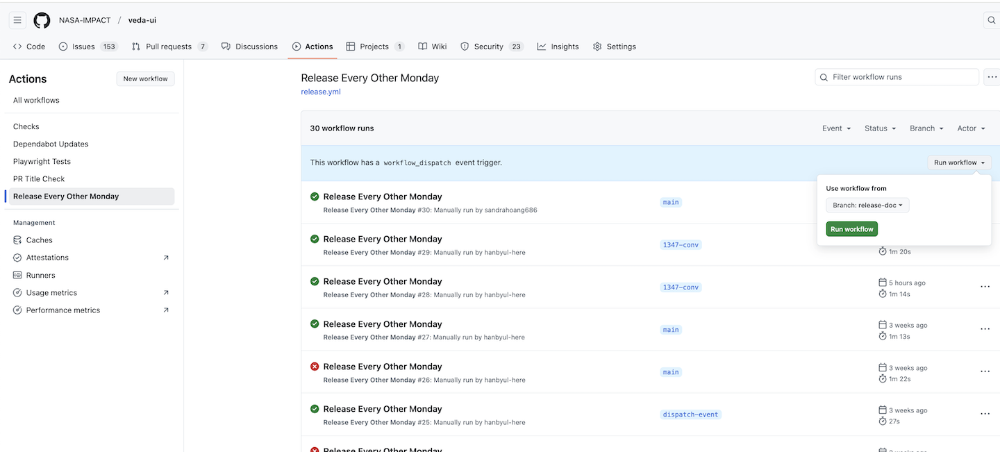
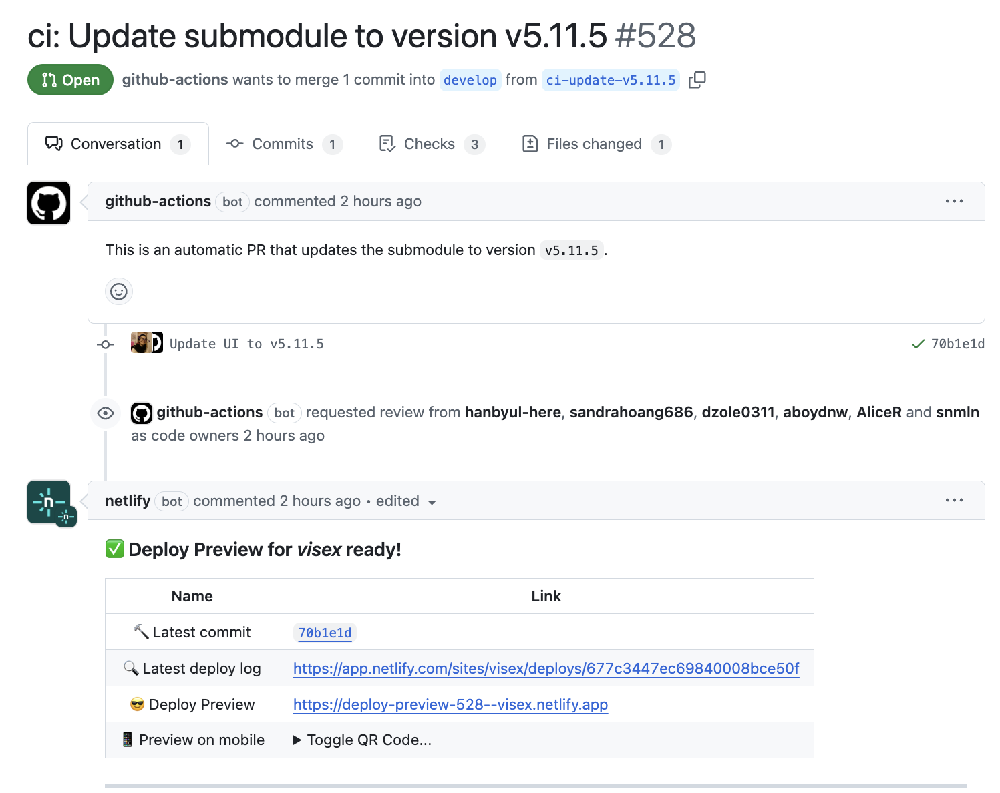

# VEDA UI Release process

## Overview

VEDA UI uses Git tags for its releases (as of Jan 2025). While releases can be manually created, the VEDA UI team recommends using the automated process facilitated by GitHub Actions. This process includes instance builds triggered by the release workflow and supports targeting specific branches when necessary. By default, the release version number is determined based on the commit message following the Conventional Commit standard.

## Release Workflow

### What is included in the automated release process

The automated process handles

- Deciding the version number based on commit history
- Creating Git tag using the version number
- Creating a commit bumping the version number up in `package.json`
- Creating GitHub Release
- Creating VEDA instance preview using VEDA UI version

### GitHub Action Integration

#### Trigger Through UI

If you are a contributor, you can trigger an action through the Actions tab. Navigate to Actions, select the release action Release every other Monday, and click the Run workflow button to initiate a release. Select the branch only if you need to make a hotfix patch release. Keep in mind that your commit message should follow the Conventional Commit format when releasing a hotfix, as the action only recognizes commits made to the production branch.

#### Instance Build

Upon triggering, the GitHub Action builds the Configuration (veda-config) instances using the specified release. It will create a Pull Request, as shown below, on veda-config, building a preview using the released UI.

### Scheduled Release

Scheduled releases are not implemented yet but are coming soon!
