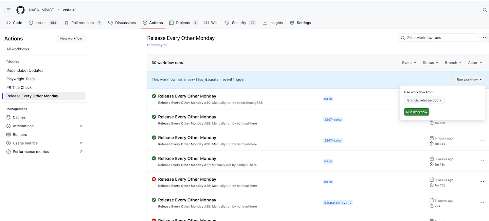
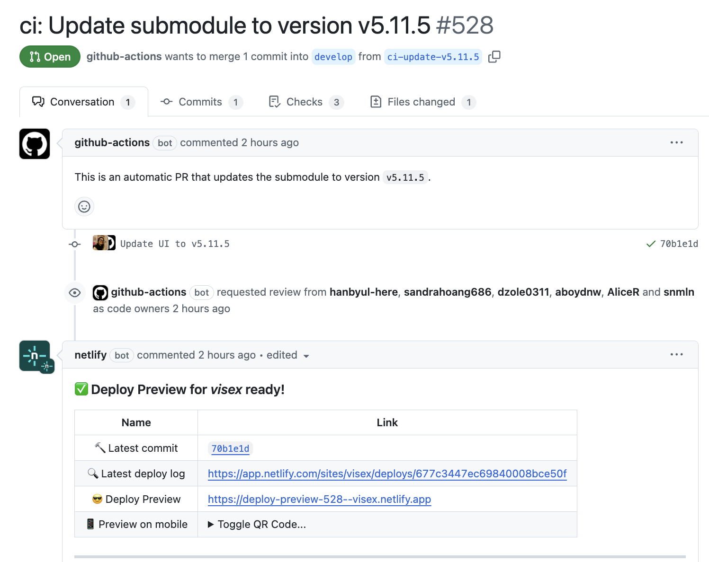

# VEDA UI Release process

## Overview

VEDA UI uses Git tags for its releases (as of Jan 2025). Releases are triggered manually via GitHub Actions. The release version number is determined based on commit messages following the Conventional Commit standard.

## Release Workflow

### What is included in the release process

The release process handles:

- Deciding the version number based on commit history
- Creating Git tag using the version number
- Creating a commit bumping the version number up in `package.json`
- Creating GitHub Release
- Creating [Earth Data instance](https://github.com/nasa-impact/veda-config) preview using VEDA UI version (when released from `main` branch)

After the last step, we can manually test if the release did not introduce any unexpected regression through the Preview URL.

### GitHub Action Integration

#### Trigger Through UI

If you are a contributor, you can trigger a release through the Actions tab. Navigate to Actions, select the **Release** workflow (default branch set to `main`), and click the Run workflow button. Select a different branch if you need to make a hotfix patch release. Keep in mind that your commit message should follow the Conventional Commit format when releasing a hotfix, as the Conventional Commit action only recognizes Pull Requests made to the production branch (`main`). Be aware that any release made from branches other than `main` won't trigger instance previews.

#### Instance Build

Upon triggering, the GitHub Action builds the [Earth Data (veda-config) instance](https://github.com/nasa-impact/veda-config) using the specified release. It will create a Pull Request, as shown below, on veda-config, building a preview using the released UI.

